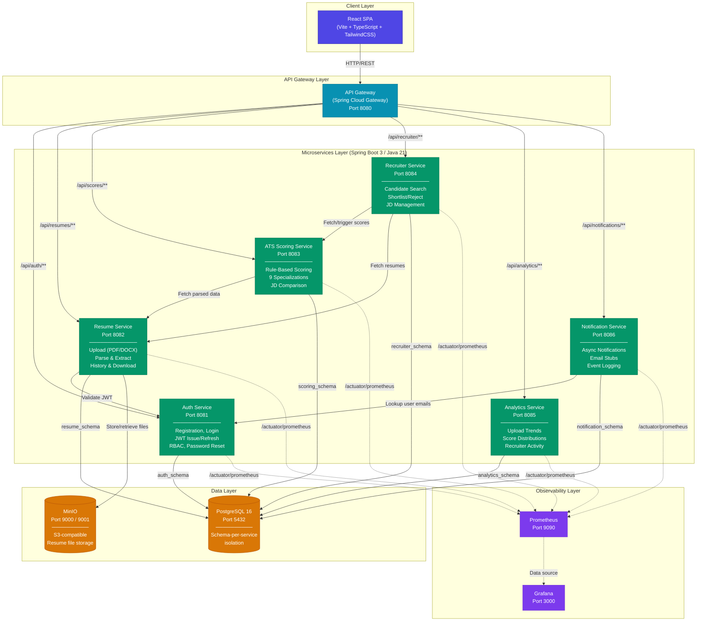
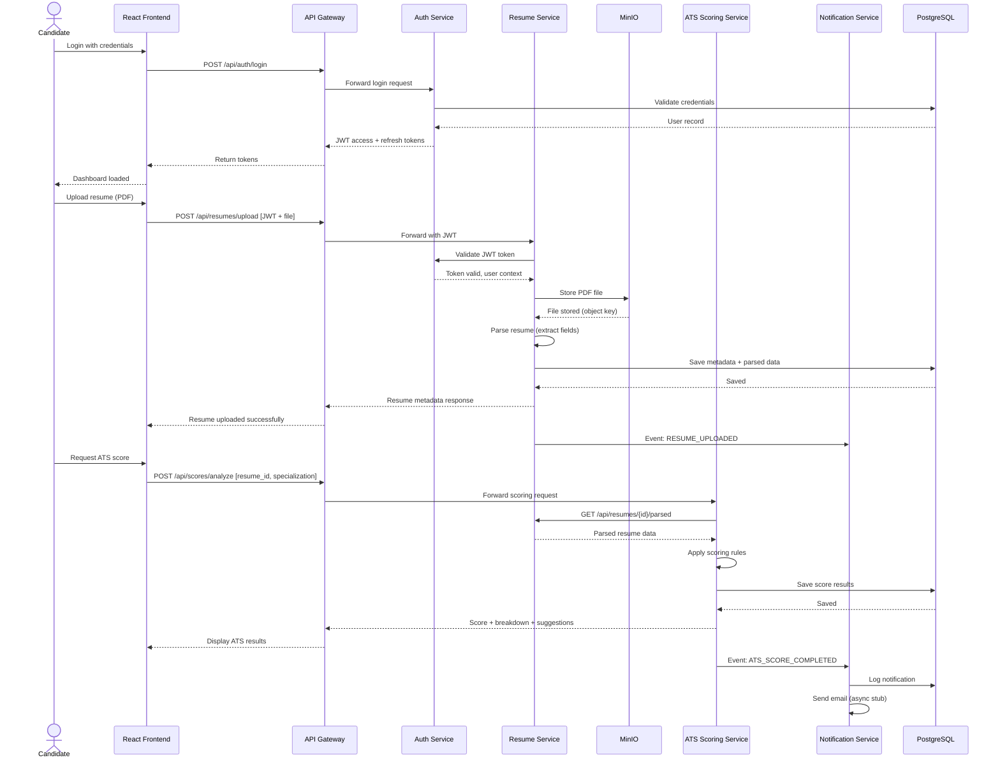
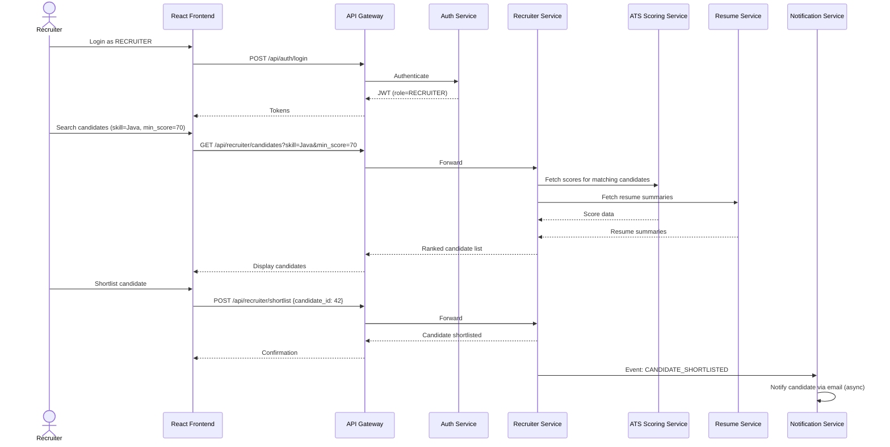

# CloudATS — System Architecture

## High-Level Architecture Diagram

```mermaid
graph TB
    subgraph Client["Client Layer"]
        FE["React SPA<br/>(Vite + TypeScript + TailwindCSS)"]
    end

    subgraph Gateway["API Gateway Layer"]
        GW["API Gateway<br/>(Spring Cloud Gateway)<br/>Port 8080"]
    end

    subgraph Services["Microservices Layer (Spring Boot 3 / Java 21)"]
        AUTH["Auth Service<br/>Port 8081<br/>─────────────<br/>Registration, Login<br/>JWT Issue/Refresh<br/>RBAC, Password Reset"]
        
        RESUME["Resume Service<br/>Port 8082<br/>─────────────<br/>Upload (PDF/DOCX)<br/>Parse & Extract<br/>History & Download"]
        
        ATS["ATS Scoring Service<br/>Port 8083<br/>─────────────<br/>Rule-Based Scoring<br/>9 Specializations<br/>JD Comparison"]
        
        RECRUITER["Recruiter Service<br/>Port 8084<br/>─────────────<br/>Candidate Search<br/>Shortlist/Reject<br/>JD Management"]
        
        ANALYTICS["Analytics Service<br/>Port 8085<br/>─────────────<br/>Upload Trends<br/>Score Distributions<br/>Recruiter Activity"]
        
        NOTIF["Notification Service<br/>Port 8086<br/>─────────────<br/>Async Notifications<br/>Email Stubs<br/>Event Logging"]
    end

    subgraph Data["Data Layer"]
        PG[("PostgreSQL 16<br/>Port 5432<br/>──────────<br/>Schema-per-service<br/>isolation")]
        MINIO[("MinIO<br/>Port 9000 / 9001<br/>──────────<br/>S3-compatible<br/>Resume file storage")]
    end

    subgraph Monitoring["Observability Layer"]
        PROM["Prometheus<br/>Port 9090"]
        GRAF["Grafana<br/>Port 3000"]
    end

    FE -->|"HTTP/REST"| GW
    
    GW -->|"/api/auth/**"| AUTH
    GW -->|"/api/resumes/**"| RESUME
    GW -->|"/api/scores/**"| ATS
    GW -->|"/api/recruiter/**"| RECRUITER
    GW -->|"/api/analytics/**"| ANALYTICS
    GW -->|"/api/notifications/**"| NOTIF

    RESUME -->|"Validate JWT"| AUTH
    ATS -->|"Fetch parsed data"| RESUME
    RECRUITER -->|"Fetch/trigger scores"| ATS
    RECRUITER -->|"Fetch resumes"| RESUME
    NOTIF -->|"Lookup user emails"| AUTH

    AUTH -->|"auth_schema"| PG
    RESUME -->|"resume_schema"| PG
    ATS -->|"scoring_schema"| PG
    RECRUITER -->|"recruiter_schema"| PG
    ANALYTICS -->|"analytics_schema"| PG
    NOTIF -->|"notification_schema"| PG

    RESUME -->|"Store/retrieve files"| MINIO

    AUTH -.->|"/actuator/prometheus"| PROM
    RESUME -.->|"/actuator/prometheus"| PROM
    ATS -.->|"/actuator/prometheus"| PROM
    RECRUITER -.->|"/actuator/prometheus"| PROM
    ANALYTICS -.->|"/actuator/prometheus"| PROM
    NOTIF -.->|"/actuator/prometheus"| PROM
    PROM -.->|"Data source"| GRAF

    classDef client fill:#4F46E5,stroke:#3730A3,color:#fff
    classDef gateway fill:#0891B2,stroke:#0E7490,color:#fff
    classDef service fill:#059669,stroke:#047857,color:#fff
    classDef data fill:#D97706,stroke:#B45309,color:#fff
    classDef monitor fill:#7C3AED,stroke:#6D28D9,color:#fff

    class FE client
    class GW gateway
    class AUTH,RESUME,ATS,RECRUITER,ANALYTICS,NOTIF service
    class PG,MINIO data
    class PROM,GRAF monitor
```

---

## Request Flow: Candidate Uploads Resume & Gets Score

```mermaid
sequenceDiagram
    actor Candidate
    participant FE as React Frontend
    participant GW as API Gateway
    participant AUTH as Auth Service
    participant RES as Resume Service
    participant MINIO as MinIO
    participant ATS as ATS Scoring Service
    participant NOTIF as Notification Service
    participant PG as PostgreSQL

    Candidate->>FE: Login with credentials
    FE->>GW: POST /api/auth/login
    GW->>AUTH: Forward login request
    AUTH->>PG: Validate credentials
    PG-->>AUTH: User record
    AUTH-->>GW: JWT access + refresh tokens
    GW-->>FE: Return tokens
    FE-->>Candidate: Dashboard loaded

    Candidate->>FE: Upload resume (PDF)
    FE->>GW: POST /api/resumes/upload [JWT + file]
    GW->>RES: Forward with JWT
    RES->>AUTH: Validate JWT token
    AUTH-->>RES: Token valid, user context
    RES->>MINIO: Store PDF file
    MINIO-->>RES: File stored (object key)
    RES->>RES: Parse resume (extract fields)
    RES->>PG: Save metadata + parsed data
    PG-->>RES: Saved
    RES-->>GW: Resume metadata response
    GW-->>FE: Resume uploaded successfully
    RES->>NOTIF: Event: RESUME_UPLOADED

    Candidate->>FE: Request ATS score
    FE->>GW: POST /api/scores/analyze [resume_id, specialization]
    GW->>ATS: Forward scoring request
    ATS->>RES: GET /api/resumes/{id}/parsed
    RES-->>ATS: Parsed resume data
    ATS->>ATS: Apply scoring rules
    ATS->>PG: Save score results
    PG-->>ATS: Saved
    ATS-->>GW: Score + breakdown + suggestions
    GW-->>FE: Display ATS results
    ATS->>NOTIF: Event: ATS_SCORE_COMPLETED

    NOTIF->>PG: Log notification
    NOTIF->>NOTIF: Send email (async stub)
```

---

## Recruiter Flow: Search & Shortlist

```mermaid
sequenceDiagram
    actor Recruiter
    participant FE as React Frontend
    participant GW as API Gateway
    participant AUTH as Auth Service
    participant REC as Recruiter Service
    participant ATS as ATS Scoring Service
    participant RES as Resume Service
    participant NOTIF as Notification Service

    Recruiter->>FE: Login as RECRUITER
    FE->>GW: POST /api/auth/login
    GW->>AUTH: Authenticate
    AUTH-->>GW: JWT (role=RECRUITER)
    GW-->>FE: Tokens

    Recruiter->>FE: Search candidates (skill=Java, min_score=70)
    FE->>GW: GET /api/recruiter/candidates?skill=Java&min_score=70
    GW->>REC: Forward
    REC->>ATS: Fetch scores for matching candidates
    REC->>RES: Fetch resume summaries
    ATS-->>REC: Score data
    RES-->>REC: Resume summaries
    REC-->>GW: Ranked candidate list
    GW-->>FE: Display candidates

    Recruiter->>FE: Shortlist candidate #42
    FE->>GW: POST /api/recruiter/shortlist {candidate_id: 42}
    GW->>REC: Forward
    REC-->>GW: Candidate shortlisted
    GW-->>FE: Confirmation
    REC->>NOTIF: Event: CANDIDATE_SHORTLISTED
    NOTIF->>NOTIF: Notify candidate via email (async)
```
